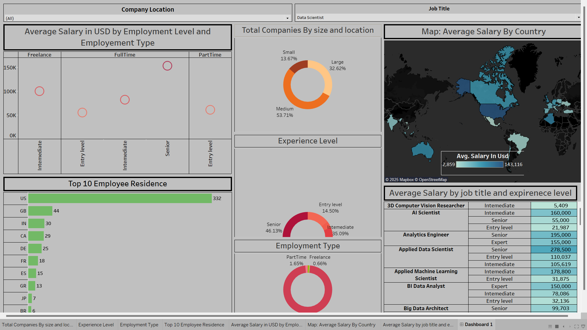

# 📊 Data Science Salaries Dashboard (Tableau Project)

You can download the Mini_Project_1.twb file and view it and edit it on the Tableau Desktop 

This project presents a dynamic Tableau dashboard built using the `ds_salaries.csv` dataset. The dashboard explores global salary trends in the data science field by analyzing various dimensions such as job title, experience level, company size, and geographic location.

---

## 🧠 Objective

To visualize and uncover insights into:
- Salary variations by job role and experience
- Distribution of data professionals by country
- Impact of company size and employment type on compensation
- Global trends in data science employment

---

## 📁 Dataset Used

- **Source**: `ds_salaries.csv`
- **Key Features**:
  - `job_title`
  - `experience_level`
  - `employment_type`
  - `company_location`
  - `employee_residence`
  - `company_size`
  - `salary_in_usd`

---

## 📊 Dashboard Features

- **Average Salary by Employment Level & Type**  
  Bubble chart comparing average salaries across employment types and experience levels.

- **Company Size & Location Distribution**  
  Donut chart showing the proportion of small, medium, and large companies.

- **Map: Average Salary by Country**  
  Interactive world map showing average salaries across countries.

- **Top 10 Employee Residences**  
  Bar chart showing the top countries where data science professionals reside.

- **Experience Level & Employment Type**  
  Donut charts providing breakdowns of experience levels and employment types.

- **Average Salary by Job Title & Experience**  
  Tabular view of salaries for different data-related job roles across experience levels.

---

## 📸 Dashboard Preview

---

## 🚀 Tools Used

- **Tableau**
- **Microsoft Excel / CSV**
- **Data Cleaning & Aggregation**

---

## 📌 Insights

- The U.S. leads with the highest number of data professionals.
- Senior-level roles show significantly higher salaries across all employment types.
- Most companies fall under the medium-size category.
- The highest-paying roles include *Applied Data Scientist* and *AI Scientist*.

---

## 🔗 Project Links

- **Tableau Public (if uploaded)**: [View Dashboard](Mini_Project_1.twb)
- **Dataset**: [Source Dataset]([https://www.kaggle.com/datasets/ruchi798/data-science-job-salaries])

---

## 👨‍💻 Author

**Rahul — B.Tech in AI & DS **

Connect with me on **[LinkedIn]([https://www.linkedin.com/posts/rahulkarthikeyanoff_tableau-dataanalytics-datascience-activity-7328086551744131072-GftB?utm_source=share&utm_medium=member_desktop&rcm=ACoAADzMGoAB6q1ATMW5ujUwvAn79gPIhhVrS3o])**

---
